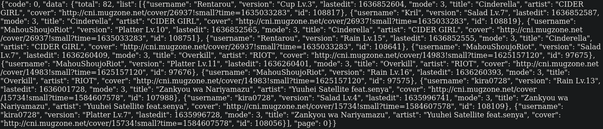
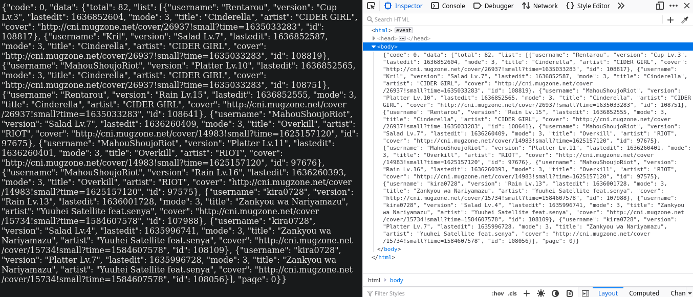
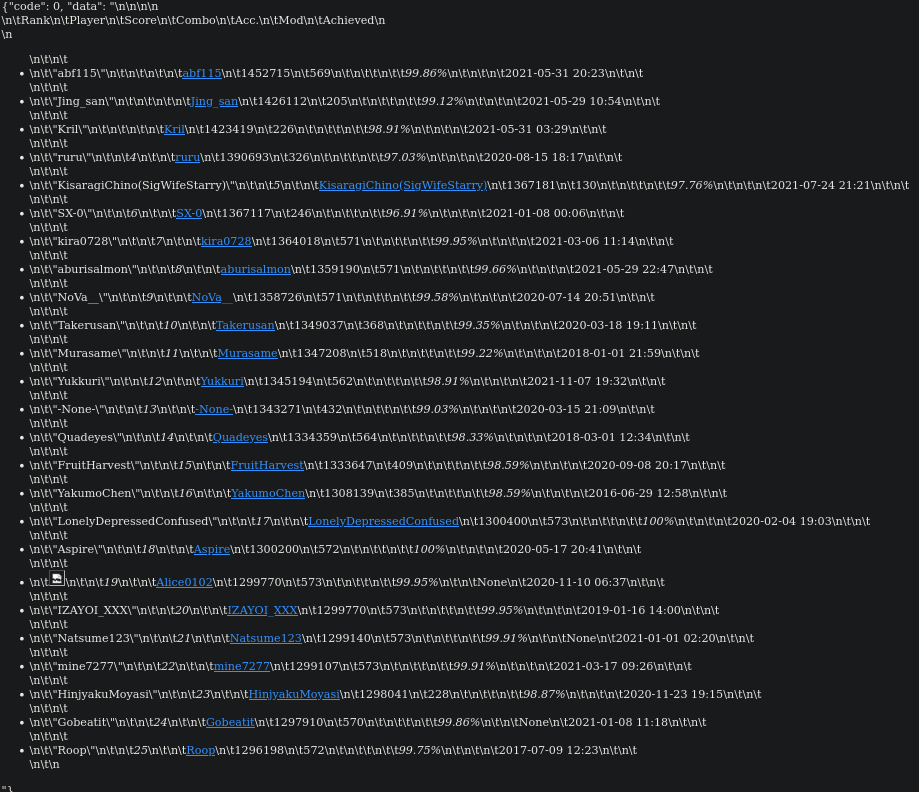
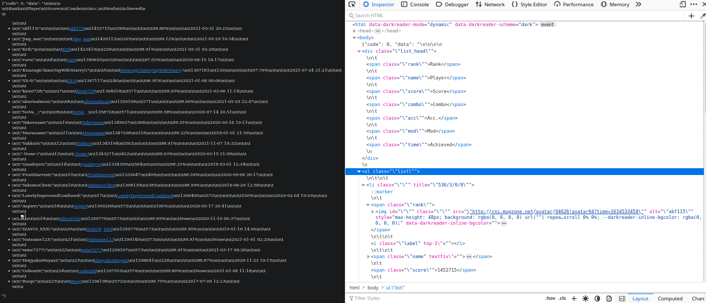

# How the server gathers Malody data
In this document, you will learn about the various methods done in order to gather all the malody!ctb data in case you are not willing to look into the source code (and I will admit, is a bit messy because of the choas of the so called quote and quote, malody api. (Notice how I'm using [quote] than ["]. It's a headache.))

## Table of Contents
**[Wait, there's an API????](#wait)**

**[The plan](#plan)**

**[It starts simple](#simple)**

**[It starts to suck](#suck)**

**[Fuck this part of the API](#fuck)**

**[The painful part is over](#over)**

**[Conclusion](#conclusion)**

## Wait, there's an API????
Well, yes and no;

Yes because... .

No because I'm not sure if it was intended to be used publicly, more specifically, in the sense that it's used for other peoples website. Documentation by the authors and developers of the API would be released and tells us about how to use it, however, after many researching attempts, all I found was [this by what I'm guessing are the official developers documenting how to work with the Store API](https://gitlab.com/mugzone_team/malody_store_api).

I've decided to go straight for the source and brute-force my way into learning of all the interesting commands and such that they may use to get their website working; and man, if I scratched the surface of the API, I don't want to delve any deepers because of the stupid shit I had to go through to make the data competant and workable; either that or I did something wrong with the API to get those annoying results and I'm just sleep deprived/angry because of the amount of hours gone trying to find an alternate solution to get the same data, to which when that didn't work, I decided to work with what I am given and try to extract the data from the HTML white noise FROM THE API?!?!?!?!?!? (more on that later.)

## The plan
Before anyone can start any extraction, you will need a plan of how you'd want your code to work where it can run regardless of human interference; this way, we won't have to constantly check up on the script to see what went wrong.

The idea, which the [python script](../../src/server/data/scripts/malody.py) still uses, is that it will get every single chart that was specifically made for catch. Thankfully, Malody's API returns the specifically catch charts which makes the whole processes of searching so much more easier. The API also blesses us with a current page and total amount of pages allowing us to see which part of the list we are in. After we gather all the list, we go through each chart of the list and gather the data recorded to the chart.

Wait a minute, why do this to gather the player's information when we can just directly rip from the user's profile? Well because I couldn't really find an API endpoint that gives the user information so I couldn't work from that. Secondly, even if I gather all the data that was specifically provided by the endpoint, I couldn't be too sure if the data would really be representive of player skill than player experience. Having to go through each one of the stable chart list and ripping through each chart can I make a calculation to determine who has better player skill over others. I would recommend you check the [python script](../../src/server/data/scripts/malody.py) or the todo list if I have completed this yet; I wouldn't consider myself too great on statistics or mathematics.

## It starts simple
You're best friend when it comes to web development or extracting information is inspect element; but not the inspector, more specifically it's lesser known but over-powered brother, `Network` (or networks or networking or something of the sort; the one that allows you to see what data is being retrieved and sent). This is basically what allowed me to see what exactly the website is doing when we make a couple of requests. Originally, I was going to go for a HTML fetch, extract and format method, but thankfully, I was granted luck went I caught wind of the API urls.

Going through the endpoint of the chart list's API gave exactly what I was finding, giving me all the relevant data per page. The specific URL endpoint being `https://m.mugzone.net/page/chart/filter?status=2&mode=3&page=[PAGE]` where `[PAGE]` is the number given.

From what I've gathered in testing, `status` means the current ranking state of the chart; where `2` is Stable, `1` is Beta, and `0` is Alpha. I would definatly want Stable rankings rather than the other two for consistency.

In regards to `mode`, it quite specific where it targets the gamemode from malody; `3` is the mode for catch which we need. There are other numbers but it's a little bit all over the place so that won't be entertained here.

Finally, the most self explainitory query, `page` gives us the specific page of the list. Each page is filled with 10 charts in there, I'm guessing to prevent overloading the user's device when requesting the information.

The URL endpoint with its queries has been modified to fit my needs since if you were to find the original query, it would be something like `https://m.mugzone.net/page/chart/filter?status=2&count=11&mode=3&tag=0&creator=&key=&next=1111111111&page=0`, where some queries are pretty self explainitory and allows for even better searching methods; however, queries such as `count`, `key`, and `next` utterly confuse me so I wouldn't really know what they would do, thankfully, they aren't as important to the original intention of the script. The original website page where I found the query was in `https://m.mugzone.net/page/all/chart?type=3`.

## It starts to suck
This was the part where I started to tear my hair out of my skull. When I visit a chart's webpage, for example `https://m.mugzone.net/chart/1103`, I checked the Networks tab and thankfully there was an API endpoint. The endpoint looks like `https://m.mugzone.net/score/1103?html=1&from=1&judge=-1` but modified is `https://m.mugzone.net/score/1103?html=1&from=1`.

I removed `judge` because from all my testings, I couldn't figure out what it does, though I will make more tests of it to see if it could be useful in the future.

The `from` query is used to distinguish from Mobile players and PC players, where `1` is for Mobile players and `0` is for PC players.

The `html` query is by far the most confusing built part of the API, where `1` formats our data to JSON which we need, but `0` just sends a HTML page with the data? From what I've experienced in other websites and their API's, this is really bizarre since API's are supposed to send you raw JSON data, not a full on designed and formatted HTML page with the data. My theory is that it is a query to just make the development of data easier which in my opinion is pretty lazy. Worse yet, if this is the case, it gives the full reason as to why I despised the return JSON data.

## Fuck this part of the API
When it comes to requesting data from the API, you would usually get information like this:

And you can even verify to see how the data is even phrased with inspector:

In web development, JSON data is all we need to work with and process data! We can do all the design and functionality of the data on the actual website, something that the endpoint regarding `https://m.mugzone.net/page/chart/filter?status=2&mode=3&page=[PAGE]` actually followed and got correct as seen above. Just pure raw JSON data.

However, for some odd reason, the approach to `https://m.mugzone.net/score/1103?html=1&from=1` was by far either the most stupid (defeats the purpose of what an API does, which is why I said that the API was probably really only intended for the website alone and this was the best they could do to either prevent bandwidth load or maybe this part of the API is old code and it hasn't been refactored?) or most lazy (defeats the pupose of what an API does, I'm guessing, the 'it just works so why fix it' mentallity is being used here) form for  you were to make an attempt to make a request to the URL endpoint as shown above, you would get a result formatted like this:

With the added benefit of the Inspector element which you can see HTML tags IN A JSON FUCKING DATA OBJECT:

If you are still confused, there are standards for a JSON object to allow for quick and easy searching. HTML does not provide that benefit because HTML is supposed to be front end development and make things pretty; an example would be that JSON would be the paintbrushes (functionality) and HTML would be the canvas (front-end design). Now, would it be useful and easy to paint when you decided to glue your paintbrushes to the fucking canvas. No? It would be impractical? Wow, no fucking shit sherlock. This is exactly what is happening as provided in the screenshots above, and now I have to get out of my way to use tools to unglue my paintbrushes from the canvas. It wasn't a fucking easy job to do so even when you have the great tools.

One tool I found called BeautifulSoup in python allowed me to get rid of the HTML tags and extract the necessary data such as text or classes. It was a tedious process but I managed to overcome it. Another annoying thing is the amount of `\n`, `\t` and `\"` which was easy to get rid of but annoying and confusing that it was even there to begin with.

## The painful part is over
Well the title isn't exactly true to be completly honest since debugging annoying stupid issues with the code and formatting data will always be apart of the programming life cycle when it comes to developing code, but I would consider debugging as apart of the lifestyle so I would say that the painful part is indeed over.

Once all the data is extracted, we can now put it on the database for everyone to see. And just like that, the beast known as the Malody API has been overcomed.

## Conclusion
Wait a minute, did I just read someone bitch and vent about a stupid thing in a very specific part of the API code? Lmao, just git gud son.

To you I say fuck you (and if you didn't say that, I unfuck you). If I were to include a conclusion, just like everything, programming is a journey with annoying steep hills and rocky roads, but, if you make an attempt and overcome, you learn more. And also never give up, because to be completly honest, I had no idea on how to approach gathering data from Malody. From the day I purchased and developed my static website as seen in [the archive folder](../../archive), I wanted to approach malody somehow but I didn't know where. It was only until recently when I forced myself into actually trying to find a way where I was able to and now I feel satisfied (yet very sleep deprived and have 0 energy).

I don't really know where I'm going with this conclusion, I guess I did just waste your time in reading how I got the Malody API to work for me and the level of shit I had to go through :d. Thanks for that, it's very much appreciated that you got this far.

But with that, I'm going off to the next journey, wherever that may be, whether it be another Malody API beast I will have to overcome again, or something else easier or worse. Until next time <3